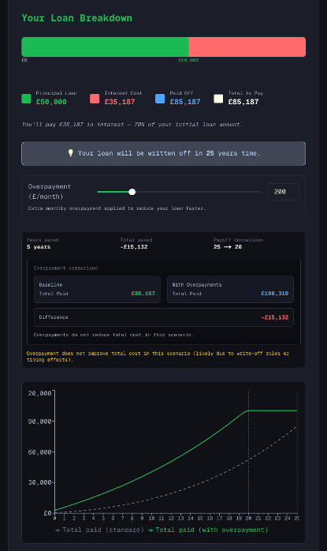

# Student Loan Calculator 2026

A financial mathematics web application that helps users understand the long-term cost of UK student loans and evaluate whether voluntary overpayments are worth making.

The project began with analytical repayment formulas and Excel prototyping, then evolved into a Python simulation engine with an interactive React frontend.

---

## 🎬 Demo


---

## 🧠 Methodology

I approached this project in three stages:

1. **Analytical maths first** - derived the repayment logic and payoff behaviour mathematically.
2. **Excel prototyping** - tested the formulas in spreadsheets to validate interactions and edge cases.
3. **Python numerical solver** - implemented the model in code for flexible, year-by-year simulation.

The model is intentionally transparent and based on explicit assumptions:

- Constant annual salary growth
- Constant bonus rate
- Constant interest rates
- No policy changes to repayment thresholds/rules during the simulation horizon

As the YouTuber Economics Explains regulary says, **"no one can predict the future, least of all economist"**  
So this tool is designed for scenario analysis and decision support, not certainty.

---

## 📈 Repayment Insights

The calculator includes a comparison line graph that shows:

- **Baseline repayments** (standard path)
- **Overpayment scenario in green**

This helps users see:

- when overpayments lead to an earlier payoff,
- how much total cost can be saved,
- and importantly, when overpaying can actually lead to spending **more** overall.



---

## 🚀 Live Site

- **Live App**: [studentloancalculator.danielskerman.com](https://studentloancalculator.danielskerman.com)
- **GitHub**: [skermind/student-loan-calculator](https://github.com/skermind/student-loan-calculator)

---

## 🧰 Tech Stack

- **Frontend**: Next.js, React, TypeScript, Tailwind CSS
- **Backend**: FastAPI, Python
- **Data/Math Layer**: JSON-configured loan plans, numerical simulation logic
- **Visualisation**: Recharts, Chart.js
- **Infrastructure**: Docker, Docker Compose, Nginx, DigitalOcean VPS

---

## ✨ Features

- UK student loan repayment simulation (Plan 1, Plan 2, Plan 4, Plan 5, Postgraduate)
- Year-by-year projections for salary, repayment, interest, and outstanding balance
- Overpayment scenario modelling to compare payoff timing and total paid
- Interactive charts and summary panels for payoff strategy decisions
- Config-driven repayment rules (`loan_plans.json`) for easier extension to new plans/countries
- Modular FastAPI + Next.js architecture for maintainability and scalability

---

## 🏗️ Architecture / Deployment

Simple flow:

User → Domain → Nginx (reverse proxy + SSL) → Next.js frontend → FastAPI backend → Loan plan config + solver

### Components

- **Domain**: Routes traffic to the VPS
- **Nginx**: SSL termination and reverse proxying
- **Next.js frontend**: UI, forms, visualisations
- **FastAPI backend**: Repayment engine and API endpoints
- **JSON plan config**: Encodes repayment thresholds/rates to avoid hard-coded logic

## 🧩 System Diagram

```text
                 ┌───────────────────────────────┐
                 │            Domain             │
                 │ studentloancalculator.        │
                 │    danielskerman.com          │
                 └───────────────┬───────────────┘
                                 │
                                 ▼
                 ┌───────────────────────────────┐
                 │             Nginx             │
                 │   Reverse Proxy + SSL (TLS)   │
                 └───────────────┬───────────────┘
                                 │
              ┌──────────────────┴──────────────────┐
              ▼                                     ▼
  ┌─────────────────────────┐           ┌─────────────────────────┐
  │      Next.js App        │  /api/*   │      FastAPI App        │
  │ (React UI + charts)     │──────────▶│ (repayment simulation)   │
  └─────────────────────────┘           └──────────────┬──────────┘
                                                        │
                                                        ▼
                                            ┌─────────────────────────┐
                                            │  loan_plans.json +      │
                                            │   Python solver logic    │
                                            └─────────────────────────┘
```

---

## 📁 Project Structure

- `/frontend` - Next.js client application
- `/backend` - FastAPI API and repayment engine
- `/backend/data/loan_plans.json` - repayment plan configuration
- `/docker-compose.yml` - multi-service deployment
- `/nginx.conf` - reverse proxy and SSL routing

---

## 🔌 API Endpoints

- `POST /calculate` - yearly repayment projection
- `POST /calculate-summary` - aggregate totals (principal, interest, outstanding)
- `POST /calculate-overpayment` - projection including overpayment scenario

---

## 📌 Notes

This project was built to answer a practical personal finance question:

**"At what salary level does making voluntary student loan overpayments become worthwhile?"**

Future improvements may include:

- Additional international loan schemes
- Scenario presets for different career/salary trajectories